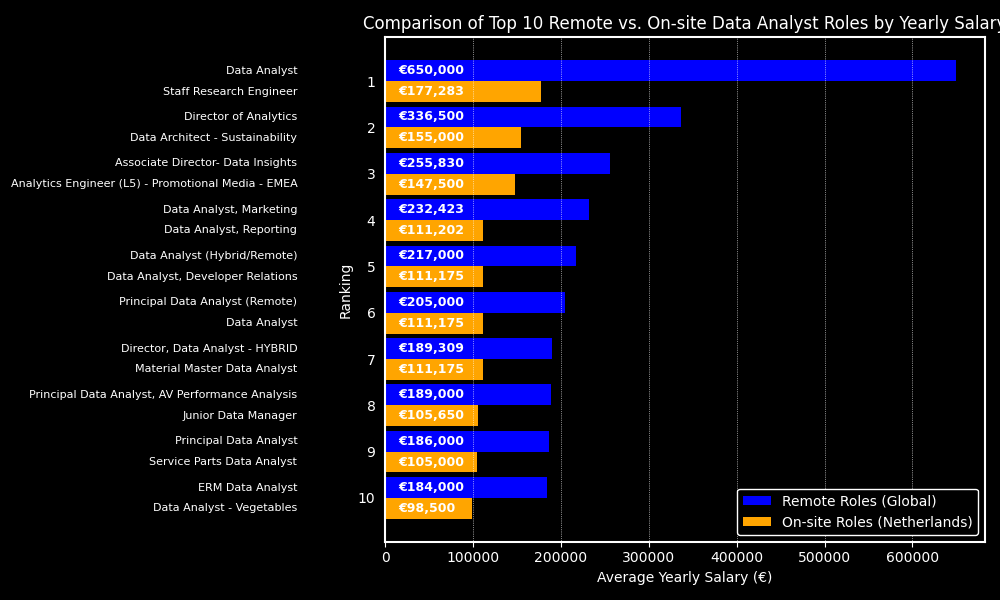

* This project is still in construction, so the SQL code is not finalised yet *
# 1. Introduction
In this project, I dive into global and Dutch job postings data to uncover **top skills in demand** and **high-paying opportunities**, providing valuable insights for job seekers and career builders. 

Using SQL, I analyzed which skills are most sought-after and which bring in the highest salaries, especially in the Netherlands, where I'm currently job hunting. The SQL-querys I built can be found in the [project_sql](/project_sql/) folder.

Whether you're looking to upskill, pivot into a new field, or simply stay competitive, this project sheds light on skills that are both highly valued and highly rewarded in today’s job market.
# 2. Background
To build my SQL skills, I completed a course led by Luke Barousse, where I followed along with his YouTube tutorial on writing SQL queries. This hands-on approach allowed me to understand core concepts while practicing directly in SQL. 

Inspired by his methods, I adapted the queries to explore insights aligned with my own career interests—specifically, analyzing in-demand skills and high-paying job roles globally and in the Netherlands. 

For anyone interested, here’s the [YouTube video](https://www.youtube.com/watch?v=7mz73uXD9DA) by Luke Barousse and a link to his [website](https://www.lukebarousse.com) where you can find the dataset that fueled my analysis.

### The questions I plan to answer in this project are:
1. What are the top-paying data analyst jobs?
2. What skills are required for these top-paying jobs?
3. What skills are most in demand for data analysts?
4. Which skills are associated with higher salaries?
5. What are the most optimal skills to learn?
# 3. Tools I Used
The tools I used to analyse the different job postings are:
- YouTube: The main support for this project was the SQL Course offered by Luke Barousse
- PostgreSQL: The database management system I used to setup my database and load in the different flat data files
- SQL: The main tool of my analysis, allowing me to write queries to retrieve relevant data important insights out of my database
- Visual Studio Code: The code editor I use to setup databases and write my queries.
- ChatGPT: The AI chatbot I used to visualise and further analyse the findings I retrieved from my queries.
- Git & GitHub: I used Git and GitHub to help me with version control and to share my SQL scripts and analysis with the world.


# 4. The Analysis
For the analysis of job postings I tried to answer the questions defined in chapter 2 the best I could by writing different SQL queries, which i will discuss the answers for in this chapter.
### 1. What are the top-paying data analyst jobs?
To identify the highest paying Data Analyst jobs, I filtered on Data Analyst positions and sorted these on average yearly salary. To make the query more interesting for myself i decided to write multiple queries to compare global remote jobs with jobs on-site in my home country 'The Netherlands'

Query 1: Global Remote Jobs
```sql
SELECT
    job_id,
    job_title,
    job_location,
    job_schedule_type,
    salary_year_avg,
    job_posted_date,
    name AS company_name
FROM
    job_postings_fact
    LEFT JOIN company_dim 
    ON job_postings_fact.company_id = company_dim.company_id
WHERE
    job_title_short = 'Data Analyst' AND
    job_location = 'Anywhere' AND
    salary_year_avg IS NOT NULL
ORDER BY
    salary_year_avg DESC
LIMIT 10
```
Query 2: On-site jobs in The Netherlands
```sql
SELECT
    job_id,
    job_title,
    job_location,
    job_schedule_type,
    salary_year_avg,
    job_posted_date,
    name AS company_name
FROM
    job_postings_fact
    LEFT JOIN company_dim 
    ON job_postings_fact.company_id = company_dim.company_id
WHERE
    job_title_short = 'Data Analyst' AND
    job_location LIKE '%Nether%' AND
    salary_year_avg IS NOT NULL
ORDER BY
    salary_year_avg DESC
LIMIT 10
```
Here is the breakdown of the top data analyst jobs for both remote jobs and jobs in The Netherlands:
- **Large salary differences**: As shown in the graph below, there is a significant difference in the top salaries between remote roles and roles in the Netherlands. The top remote roles pay between €184,000 and €650,000, while the highest paying jobs in the Netherlands range from €98,500 to €177,283.
  
- **Similar average salaries**: While the top salaries are much higher for remote roles, the average salaries for Data Analyst job postings are much closer. In fact, the average salary for job postings in the Netherlands is slightly higher, with an average yearly income of €98,278, compared to the global average for remote roles, which is €94,769.



| Average Description                           | Average Income       |
|-----------------------------------------------|----------------------|
| Data Analyst Job Postings in The Netherlands  | €98,278.03             |
| Remote (global) Job Postings                  | €94,769.86             |


# 5. What I Learned
Throughout this project, I was able to put my theoretical knowledge from various courses into practice.
- **Database setup** 💾: I set up a PostgreSQL database and   linked it to VS Code, providing a seamless environment for querying and analysis.
- **Query writing** 🧩: I practiced writing SQL queries, gaining comfort with the basics and more advanced techniques, such as:
    - Aggregate functions like COUNT() and AVG() used in combination with GROUP BY
    - Common Table Expressions (CTE's)
    - Joins
- **Git/GitHub and Repositories** 🔗: I became comfortable with basic Git commands, like push and pull, and successfully created and linked a repository from VS Code to GitHub for version control and sharing.
# 6. Conclusions

